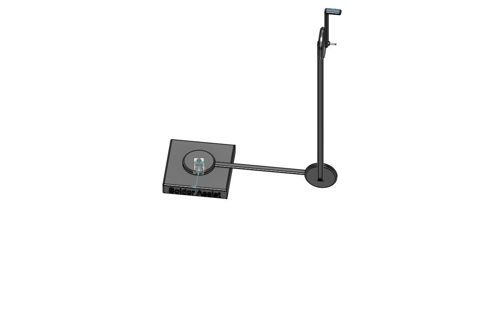
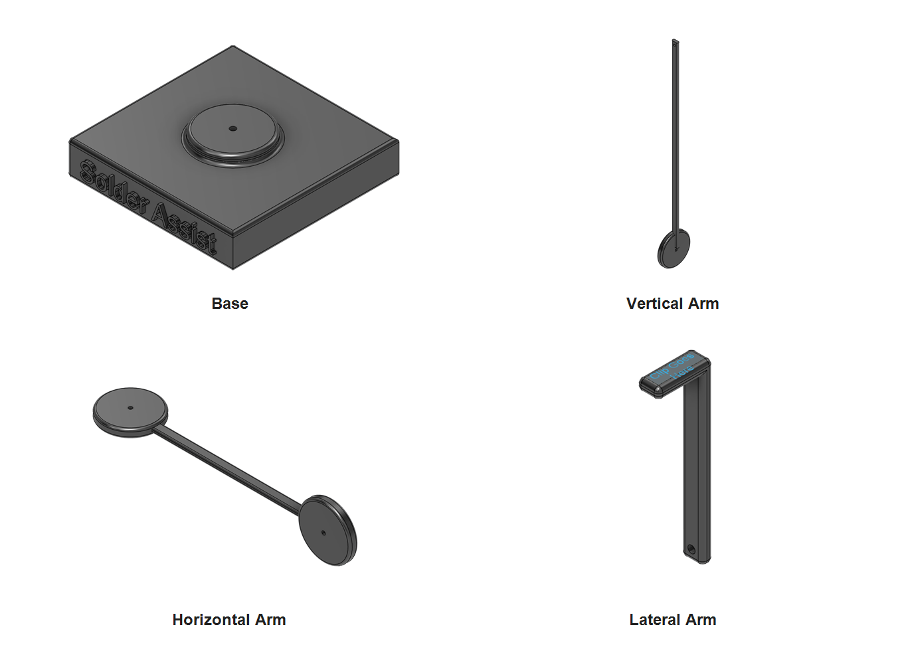

# July 25th: Completed the initial CAD design

I completed the first full CAD design of Solder Assist using Fusion 360. I began by planning the project around a weighted steel base, three adjustable arm sections, and simple friction-based joints.

I designed the base, vertical arm, horizontal arm, and lateral arm as separate components. This made the assembly modular and allowed each part to be edited, replaced, or reprinted individually.

After creating the individual components, I assembled them in Fusion 360 to check the alignment of the joints, clearances between parts, overall proportions, and expected range of motion. The joints were designed to use M3 × 25 mm socket head cap screws and M3 hex nuts.

I exported the completed models as the following STEP files:

- `Base.step`
- `Vertical Arm.step`
- `Horizontal Arm.step`
- `Lateral Arm.step`
- `Solder Assist.step`

The main challenge was creating adjustable joints without making the design unnecessarily complicated. I selected friction-based joints because they reduced the number of parts and allowed the arm positions to be adjusted by tightening or loosening the M3 hardware.

Software used:

- Autodesk Fusion 360

Lapse link:

- Not available

**Total time spent: 1h**
