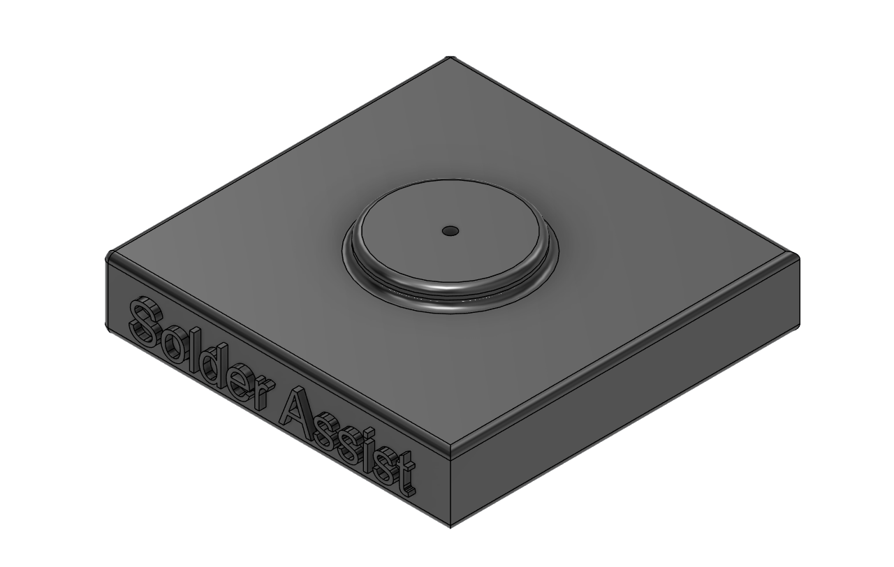

# Solder Assist

Solder Assist is a modular desktop soldering assistance tool designed to hold printed circuit boards, wires, and small electronic components in position during soldering, assembly, inspection, and repair.

The system uses a rigid steel base and multiple articulated 3D-printed arms. Each arm can be positioned independently to support different workpiece sizes, shapes, and working angles.

---

## Project Overview

Soldering small electronics often requires the user to hold a component, wire, solder, and soldering iron at the same time. Solder Assist reduces this difficulty by securely positioning the workpiece while keeping both hands available.

The design is intended to be:

- modular
- adjustable
- compact
- inexpensive to manufacture
- easy to repair
- primarily 3D printed
- assembled using common M3 hardware

---

## Features

- Rigid steel base for stability
- Multiple independently adjustable arms
- Modular arm arrangement
- 3D-printable mechanical components
- Standardized M3 hardware
- Adjustable vertical and horizontal positioning
- Suitable for PCBs, wires, connectors, and small electronics
- Components can be replaced or redesigned individually
- Compact desktop footprint

---

## Main Components

### Base

The base provides the main structural support for the system.



A steel base is used to:

- reduce movement during soldering
- improve stability
- support multiple articulated arms
- prevent the assembly from tipping during use

### Vertical Arm

The vertical arm raises the holding mechanism above the base and provides height adjustment.


### Horizontal Arm

The horizontal arm extends the working area outward from the vertical support.


### Lateral Arm

The lateral arm provides additional positioning control and allows the end holder to approach the workpiece from different angles.


### Complete Assembly

The full Solder Assist assembly combines the base, vertical arm, horizontal arm, and lateral arm into one adjustable desktop tool.


---

## Hardware

The current design uses:

- M3 × 25 mm socket head cap screws
- M3 hex nuts
- steel base
- 3D-printed arm components
- workpiece clips or holders

Additional washers, locking nuts, threaded inserts, or friction materials may be added during later revisions.

---

## CAD Files

The project includes the following STEP files:

- `Base.step`
- `Vertical Arm.step`
- `Horizontal Arm.step`
- `Lateral Arm.step`
- `Solder Assist.step`

These files can be opened in CAD software such as:

- Fusion 360
- SolidWorks
- FreeCAD
- Autodesk Inventor
- Onshape

---

## Repository Structure

```text
Solder-Assist/
|-- BOM/
|   `-- BOM.csv
|-- CAD/
|   |-- Base.step
|   |-- Vertical Arm.step
|   |-- Horizontal Arm.step
|   |-- Lateral Arm.step
|   `-- Solder Assist.step
|-- Images/
|   |-- Base.png
|   |-- Vertical Arm.png
|   |-- Horizontal Arm.png
|   |-- Lateral Arm.png
|   `-- Solder Assist.png
|-- Journal.md
`-- README.md
```

---

## Assembly Overview

1. Place the steel base on a stable work surface.
2. Install the vertical arm onto the base.
3. Attach the horizontal arm to the vertical arm.
4. Attach the lateral arm to the horizontal arm.
5. Insert the M3 hardware through the joint holes.
6. Tighten each joint until it can hold its position while still remaining adjustable.
7. Attach the PCB, wire, or component holder to the end of the arm.
8. Test the full range of motion before using the system near a soldering iron.

Do not overtighten the joints, as this could damage the printed components or prevent adjustment.

---

## 3D Printing

The arm components are intended to be manufactured using FDM 3D printing.

Recommended starting settings:

| Setting | Recommendation |
|---|---|
| Material | PLA+, PETG, or stronger |
| Layer height | 0.20 mm |
| Walls | 4 or more |
| Top and bottom layers | 4 or more |
| Infill | 30–50% |
| Supports | As required |
| Orientation | Position parts to strengthen joint areas |

Joint sections and bolt holes should be printed with sufficient wall thickness to resist cracking.

Print settings may need to be adjusted depending on the printer, filament, and final joint design.

---

## Bill of Materials

The project bill of materials is stored in:

```text
BOM/BOM.csv
```

The BOM should include:

- component name
- quantity
- material
- manufacturing method
- hardware dimensions
- estimated cost
- notes

---

## Intended Uses

Solder Assist may be used for:

- holding printed circuit boards
- positioning wires
- holding connectors
- supporting small electronic assemblies
- inspection and repair
- component alignment
- prototyping
- small-scale assembly work

---

## Safety

- Keep all printed parts away from the soldering iron tip.
- Do not allow hot solder to collect on plastic components.
- Place the assembly on a stable, heat-resistant surface.
- Confirm all joints are secure before beginning work.
- Do not position flammable materials near the soldering area.
- Use appropriate ventilation or a fume extractor.
- Wear eye protection when cutting wires or soldering.
- Allow recently soldered components to cool before touching them.

---

## Current Limitations

- Joint friction may require further adjustment.
- Printed arms may flex under heavier loads.
- The current design does not include powered movement.
- The system does not currently include an integrated fume extractor.
- The final component-holder design may change after physical testing.
- Print tolerances may need adjustment depending on the printer used.

---

## Future Improvements

Possible future improvements include:

- interchangeable end-effectors
- alligator clip attachments
- PCB-specific holders
- soldering-iron holder
- solder spool holder
- integrated LED lighting
- magnifying lens mount
- camera mount
- fume-extractor attachment
- improved joint-locking mechanisms
- threaded inserts
- stronger materials
- additional articulated arms

---

## Development Status

**Current stage:** Initial CAD design completed

The next development steps are:

1. Print the first prototype.
2. Assemble the arm system.
3. Test joint movement and holding strength.
4. Test stability on the steel base.
5. Identify weak or difficult-to-adjust components.
6. Revise the CAD files.
7. Test the system with a PCB and small electronic components.

---

## Author

**Aamir Khan Pathan**

---

## License

A project license has not yet been selected.

Until a license is added, all project files and designs remain under the author’s default copyright.
